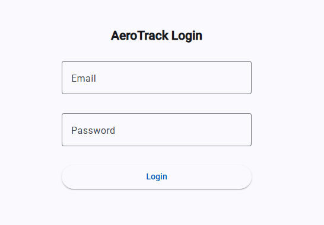
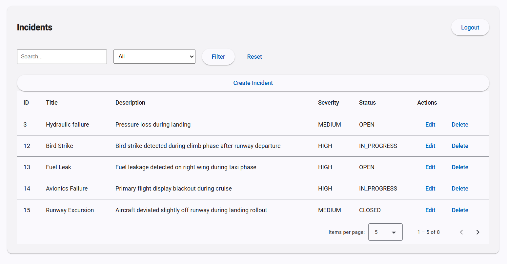
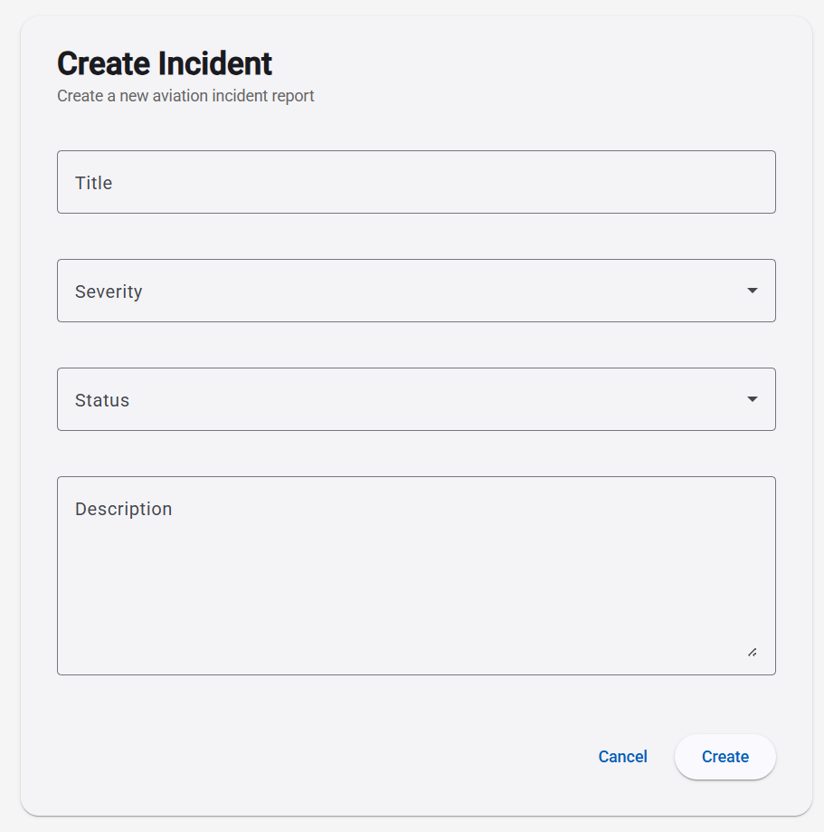
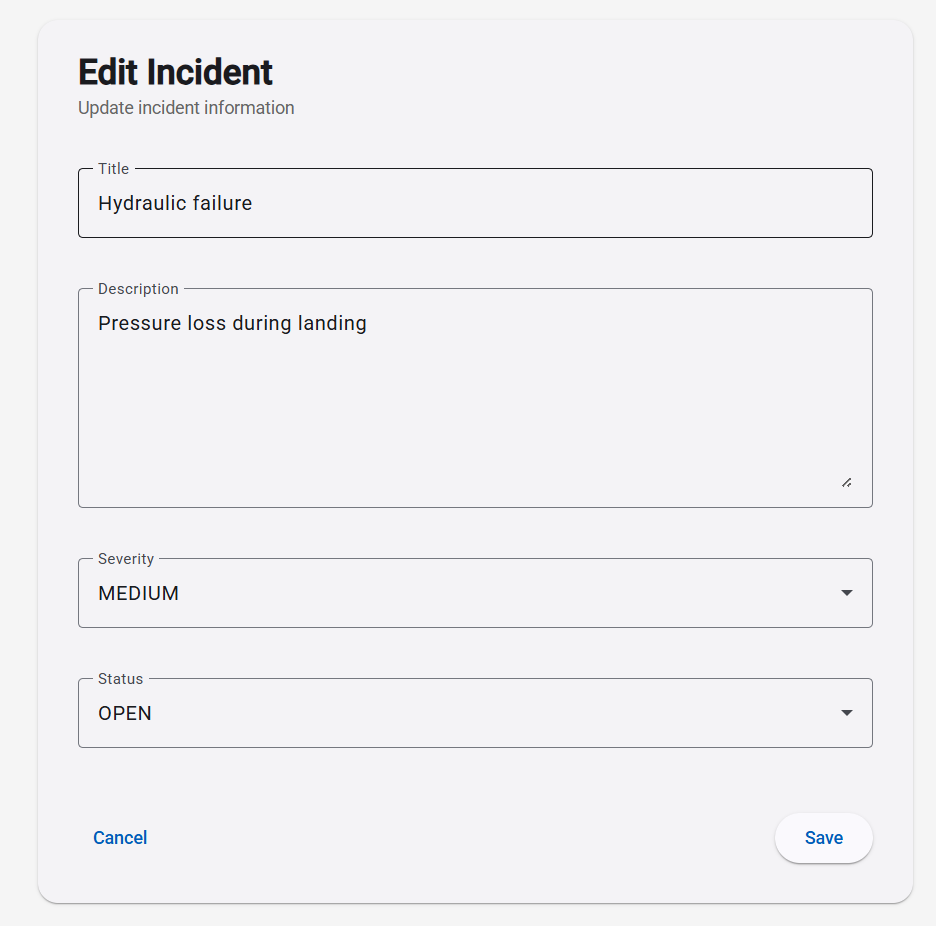

# ✈️ AeroTrack — Fullstack Aviation Incident Management System

AeroTrack is a fullstack web application designed to manage aviation incidents with secure authentication, role-based access control, and a modern Angular UI.

This project is a portfolio-grade application built to demonstrate backend (Spring Boot) and frontend (Angular) engineering skills in an enterprise context.

---

## 🧰 Tech Stack

### Backend
- Java 21
- Spring Boot 3
- Spring Security + JWT
- PostgreSQL
- MapStruct
- Maven

### Frontend
- Angular
- Angular Material
- RxJS
- JWT Authentication

---

## 🚀 Features

### Authentication & Security
- JWT-based authentication
- Role-based access control (ADMIN / USER)
- Protected routes (frontend + backend)
- HTTP interceptor for token injection

### Incident Management
- Full CRUD operations (Create, Read, Update, Delete)
- Incident severity and status management
- Admin-only creation and modification
- RESTful API design

### Data Handling
- Pagination
- Filtering (keyword, severity)
- Server-side processing

### Frontend UI
- Angular Material responsive UI
- Incident table with actions
- Role-based UI rendering
- Reactive forms (create / edit)
- Clean layout with reusable components

### DevOps / Quality
- Backend + PostgreSQL containerized using Docker Compose
- Reproducible local environment via Docker
- CI/CD pipeline (GitHub Actions) - planned
- Unit tests (backend & frontend) - planned

---

## 🏗 Architecture

### Backend
Clean layered architecture:

```
Controller → Service → Repository → Mapper → DTO
```


### Frontend
Feature-based Angular structure:

- Feature modules (auth, incidents)
- Route guards
- HTTP interceptor
- Standalone components

---

## 🔌 API Endpoints

### Auth
- POST `/api/auth/login`

### Incidents
- GET `/api/incidents`
- GET `/api/incidents/{id}`
- GET `/api/incidents/search`
- POST `/api/incidents`
- PUT `/api/incidents/{id}`
- DELETE `/api/incidents/{id}`

---

## 📸 Screenshots

### Login


### Incident List


### Create Incident


### Edit Incident


---

## 🧪 Run Locally

### Backend (without Docker)

```bash
cd backend
mvn spring-boot:run
```

### Backend + Database (Docker)

```bash
cd backend
mvn clean package -DskipTests
docker compose up --build
```

---

📌 Project Status

- ✔ Backend MVP completed
- ✔ Frontend MVP completed
- ✔ Docker setup completed (backend + database)
- 🚧 Frontend containerization (next step)
- 🚧 CI/CD (GitHub Actions) planned
- 🚧 Unit tests (backend + frontend) planned

---

🎯 Purpose

This project simulates an internal aviation incident management system used in enterprise environments. It demonstrates secure API design, layered backend architecture, and a modern frontend implementation using Angular Material.

---

🧭 Next Steps
- Dockerize frontend (Angular + Nginx)
- Add docker-compose for full stack startup
- Add CI/CD pipeline (GitHub Actions)
- Add unit tests (backend + frontend)